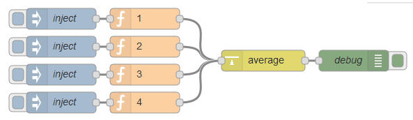

node-red-contrib-average
========================

[](http://github.com/eisbehr-/node-red-average)
[](http://www.npmjs.org/package/node-red-contrib-average)
[](https://david-dm.org/eisbehr-/node-red-average)

A <a href="http://nodered.org" target="_new">Node-RED</a> node to calculate average (_avg_).

---

## Table of Contents
* [Install](#install)
* [Usage](#usage)
* [Example Flow](#example-flow)
* [Bugs / Feature request](#bugs--feature-request)
* [License](#license)
* [Donation](#donation)

---

## Install

Run the following command in your Node-RED user directory - typically `~/.node-red`:

```
npm install node-red-contrib-average
```


## Usage

Calculate the average of incoming `msg.payload` values.

Incoming `msg.topic` has to be used to separate and identify values.
Messages not containing a valid numeric value will be rejected.

Will return the current average as `msg.payload`. Every other data will be pushed through.


## Example Flow

Simple example showing how to calculate and average of static values.



```JSON
[{"id":"470977d9.9fb538","type":"tab","label":"Average"},{"id":"b022f03f.da047","type":"average","z":"470977d9.9fb538","name":"","x":380,"y":100,"wires":[["5a8eea2a.b67d3c"]]},{"id":"5a8eea2a.b67d3c","type":"debug","z":"470977d9.9fb538","name":"debug","active":true,"console":"false","complete":"payload","x":510,"y":100,"wires":[]},{"id":"c79942e7.6ae498","type":"inject","z":"470977d9.9fb538","name":"inject","topic":"","payload":"","payloadType":"date","repeat":"","crontab":"","once":false,"x":90,"y":40,"wires":[["9e21e8a4.2b5008"]]},{"id":"5b6c2de0.a35dc4","type":"inject","z":"470977d9.9fb538","name":"inject","topic":"","payload":"","payloadType":"date","repeat":"","crontab":"","once":false,"x":90,"y":80,"wires":[["3b773c9e.3ca9e4"]]},{"id":"689a005a.9f41b8","type":"inject","z":"470977d9.9fb538","name":"inject","topic":"","payload":"","payloadType":"date","repeat":"","crontab":"","once":false,"x":90,"y":120,"wires":[["982f1441.062f68"]]},{"id":"3b773c9e.3ca9e4","type":"function","z":"470977d9.9fb538","name":"two","func":"return {\n    topic: \"topic_two\",\n    payload: 2\n};","outputs":1,"noerr":0,"x":210,"y":80,"wires":[["b022f03f.da047"]]},{"id":"9e21e8a4.2b5008","type":"function","z":"470977d9.9fb538","name":"one","func":"return {\n    topic: \"topic_one\",\n    payload: 1\n};","outputs":1,"noerr":0,"x":210,"y":40,"wires":[["b022f03f.da047"]]},{"id":"982f1441.062f68","type":"function","z":"470977d9.9fb538","name":"three","func":"return {\n    topic: \"topic_three\",\n    payload: 3\n};","outputs":1,"noerr":0,"x":210,"y":120,"wires":[["b022f03f.da047"]]},{"id":"4b264eb1.263c88","type":"inject","z":"470977d9.9fb538","name":"inject","topic":"","payload":"","payloadType":"date","repeat":"","crontab":"","once":false,"x":90,"y":160,"wires":[["907f77f5.8236f"]]},{"id":"907f77f5.8236f","type":"function","z":"470977d9.9fb538","name":"four","func":"return {\n    topic: \"topic_four\",\n    payload: 4\n};","outputs":1,"noerr":0,"x":210,"y":160,"wires":[["b022f03f.da047"]]}]
```


## Bugs / Feature request
Please [report](http://github.com/eisbehr-/node-red-average/issues) bugs and feel free to [ask](http://github.com/eisbehr-/node-red-average/issues) for new features directly on GitHub.


## License
This project is licensed under [Apache 2.0](http://www.apache.org/licenses/LICENSE-2.0) license.


## Donation
_You like to support me?_  
_You appreciate my work?_  
_You use it in commercial projects?_  
  
Feel free to make a little [donation](https://www.paypal.com/cgi-bin/webscr?cmd=_s-xclick&hosted_button_id=FFL6VQJCUZMXC)! :wink: