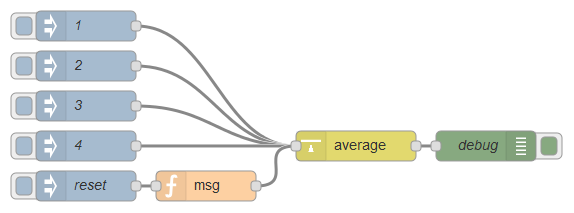

node-red-contrib-average
========================

[](http://github.com/dkern/node-red-average)
[](http://www.npmjs.org/package/node-red-contrib-average)
[](https://david-dm.org/dkern/node-red-average)

A <a href="http://nodered.org" target="_new">Node-RED</a> node to calculate average (_avg_).

---

## Table of Contents
* [Install](#install)
* [Usage](#usage)
* [Example Flow](#example-flow)
* [Bugs / Feature request](#bugs--feature-request)
* [License](#license)
* [Donation](#donation)

---

## Install

Run the following command in your Node-RED user directory - typically `~/.node-red`:

```
npm install node-red-contrib-average
```


## Usage

Calculate the average of incoming `msg.payload` values from across a number of different `msg.topic`.

Incoming `msg.topic` has to be used to separate and identify values.
Messages not containing a valid numeric value will be rejected.

Will return the current average of all different `msg.topic` values as `msg.payload` the number of different `msg.topic` used to calculate the avergae in `msg.amount`.
Every other data will be pushed through.

The average can be reset with an incoming message that contains `msg.reset`.
Then all stored data will be removed and the initial average starts at zero again.


## Example Flow

Simple example showing how to calculate and average of static values.



```JSON
[{"id":"5a8eea2a.b67d3c","type":"debug","z":"470977d9.9fb538","name":"debug","active":true,"console":"false","complete":"true","x":870,"y":200,"wires":[]},{"id":"c79942e7.6ae498","type":"inject","z":"470977d9.9fb538","name":"1","topic":"name_one","payload":"1","payloadType":"num","repeat":"","crontab":"","once":false,"x":470,"y":80,"wires":[["60d50df3.aacf5c"]]},{"id":"5b6c2de0.a35dc4","type":"inject","z":"470977d9.9fb538","name":"2","topic":"name_two","payload":"2","payloadType":"num","repeat":"","crontab":"","once":false,"x":470,"y":120,"wires":[["60d50df3.aacf5c"]]},{"id":"689a005a.9f41b8","type":"inject","z":"470977d9.9fb538","name":"3","topic":"name_three","payload":"3","payloadType":"num","repeat":"","crontab":"","once":false,"x":470,"y":160,"wires":[["60d50df3.aacf5c"]]},{"id":"4b264eb1.263c88","type":"inject","z":"470977d9.9fb538","name":"4","topic":"name_four","payload":"4","payloadType":"num","repeat":"","crontab":"","once":false,"x":470,"y":200,"wires":[["60d50df3.aacf5c"]]},{"id":"60d50df3.aacf5c","type":"average","z":"470977d9.9fb538","name":"","topic":"","x":740,"y":200,"wires":[["5a8eea2a.b67d3c"]]},{"id":"96ae6e69.adecc8","type":"inject","z":"470977d9.9fb538","name":"reset","topic":"","payload":"","payloadType":"date","repeat":"","crontab":"","once":false,"x":470,"y":240,"wires":[["49c46c67.385fc4"]]},{"id":"49c46c67.385fc4","type":"function","z":"470977d9.9fb538","name":"msg","func":"msg.reset = true;\nreturn msg;","outputs":1,"noerr":0,"x":590,"y":240,"wires":[["60d50df3.aacf5c"]]}]
```


## Bugs / Feature request
Please [report](http://github.com/dkern/node-red-average/issues) bugs and feel free to [ask](http://github.com/dkern/node-red-average/issues) for new features directly on GitHub.


## License
This project is licensed under [Apache 2.0](http://www.apache.org/licenses/LICENSE-2.0) license.


## Donation
_You like to support me?_  
_You appreciate my work?_  
_You use it in commercial projects?_  
  
Feel free to make a little [donation](https://www.paypal.com/cgi-bin/webscr?cmd=_s-xclick&hosted_button_id=FFL6VQJCUZMXC)! :wink:
